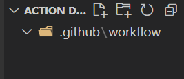

# 使用 Github Actions 自动化部署你的网页

很多人都知道可以使用 [Github Page](https://pages.github.com/) 来部署静态网页。

我们把本地的代码打包之后，在推送到远程仓库中，然后在把打包的文件夹（一般是 `dist`）推送到部署的那个分支上（一般是 `gh-pages`）。

虽然步骤很简单，但是当我们每一次更新代码之后，都要重复一遍这样的工作，久而久之，就会浪费很多休息时间；而且这么做也有一定的风险，万一哪天你忘记把最新的 `dist` 推送到 `gh-pages` 分支，那么你网站的内容就不会进行更新，影响用户的使用。

那有没有什么办法，在我们把代码提交到主分支（`master`）时，自动帮我们把 `dist` 文件夹中的内容自动推送到 `gh-pages` 分支中呢？

当然有啦，我们可以使用 `Github Actions` 来解放我们的双手。

## Github Actions

- `Github Actions` 是什么呢？

  > 它是一种持续集成和持续交付平台，我们可以将它用于自动执行生成、测试和部署。
  > 我的个人理解：
  > 就比如我们想要实现上面的需求，我们需要编写一段脚本，脚本代替我们去执行。由于这些需求具有极高的耦合度，也为了提高开发者的开发效率，`Github` 把这些脚本集合在 [GitHub Marketplace](https://github.com/marketplace) 中，统称他们为 `actions`。我们可以把自己需要的 `action` 进行组合已完成自己的需求。当然啦，如果你不想使用 `GitHub Marketplace` 中的 `action` 也可以自己进行编写，甚至可以把自己编写的 `action` 上传到 `GitHub Marketplace` 中。

- 认识工作流

  > 在我们对 `Github Actions` 有了一个初步的了解之后，在进行使用之前，我们还需要了解另一个知识点，那就是工作流。

  - 什么是工作流呢？

    > 工作流是一个可配置的自动化过程，它将运行一个或多个作业。它在存储库的 `yaml` 文件中定义，并且会在存储库中的事件触发时运行，也可以手动触发或者按照定义的时间触发。

    > 在一个存储库中，我们可以有多个工作流，每个工作流可以执行不同的任务。它们全部都定义在存储库的 `.github/workflows` 中。

- 使用 `Github Actions`

  > 我们知道了 `Github Actions`，也了解了 `工作流`。现在我们就来创建一个工作流，完成我们的部署工作吧。

  - 我们在我们的存储库中执行这样一条命令，用于创建存放工作流的目录。

    ```shell
      mkdir .github && cd .github && mkdir workflow
    ```

    结果是这样的：

    

  - 现在我们来配置我们的部署工作流，在 `.github/workflows` 文件夹中创建一个名为 `deploy.yml` 的文件，我们的工作流将在这里编写：

    ```yaml
    name: deploy demo # 这个工作流的名字
    on: # 用于监听存储库的事件
      push: # 我们这里监听 push 事件
        braches: # 监听的分支
          - master # master 分支
    # 👆上面四行脚本的意思是：我们只监听关于 master 的 push 事件

    jobs: # 代表工作的意思
      deploy: # 这个工作的名字是 deploy
        runs-on: ubuntu-latest # 这个工作在什么运行器上运行，这里的意思是在最新版本的 Ubuntu Linux 上运行
        steps: # 完成这个工作需要哪些步骤
          - name: checkout # 步骤一的名字
            uses: actions/checkout@v3 # uses 代表着在这里步骤中会运行 actions/checkout@v3 这是将代码签出到运行器上的意思 如果有什么需要注意的，可以写在 with 中，如下
          - name: deploy # 步骤二的名字
            uses: peaceiris/actions-gh-pages@v3 # 运行 peaceiris/actions-gh-pages@v3 可以将静态文件部署到 Github Page 上，下面是一些使用 peaceiris/actions-gh-pages@v3 需要的配置，具体的可以看文档
            with:
              github_token: ${{ secrets.GITHUB_TOKEN }}
              publish_dir: ./dist
              publish_branch: gh-pages
    ```

  - 当我们完成上面这步的时候，`Github Actions` 就会监听我们 `push` 到 `master` 分支上的事件，然后自动运行 `deploy.yml` 文件，达到一个部署静态页面的效果。

---

参考资料：

【1】：Github Page：https://pages.github.com/

【2】：Github Actions：https://docs.github.com/zh/actions/learn-github-actions/understanding-github-actions

【3】：peaceiris/actions-gh-pages@v3：https://github.com/marketplace/actions/github-pages-action
